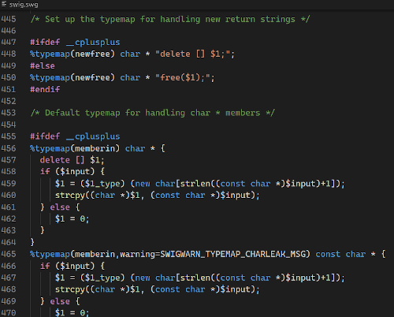
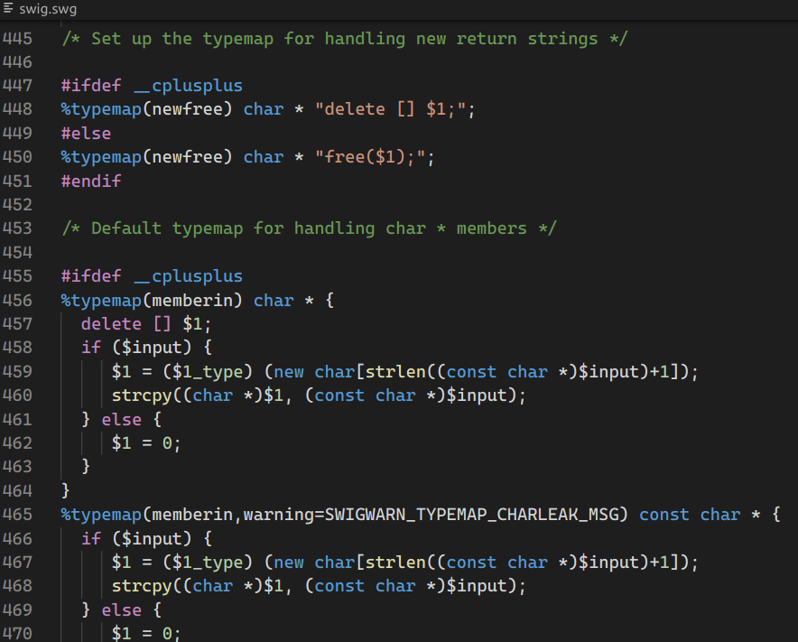

# swiglang

A language support extension for SWIG (Simplified Wrapper and Interface Generator) .

## Features

* Syntax Highlights
* (TBD) IntelliSense
* Snippets

## Release Notes

### 0.0.2

Initial release

-------------------------------------------------------------------------------

